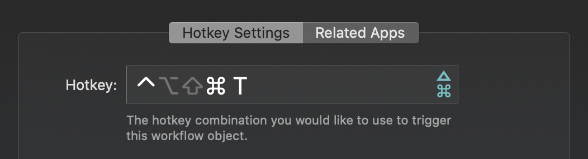

  <h1>Alfred Browser Tabs 🔍</h1>

  <strong>Search browser tabs from Chrome, Brave, Safari, etc..</strong>

## Why?

You have hundreds of tabs open that you need to sift through and ain't nobody got time for that.

## Features

- 🏎 Blazing fast!
- 💪 Supports Chrome, Brave, Edge, Vivaldi, Safari, Orion.
- 🔍 Fuzzy search title & URLs.
- ✨ Relevant results (last active window).
- 🌶️ Customizable hotkeys & keywords.
- 📋 Copy URL to clipboard.

## Installation

1. Download the Alfred Workflow ([Browser-Tabs.alfredworkflow](https://github.com/epilande/alfred-browser-tabs/releases/latest/download/Browser-Tabs.alfredworkflow)).
1. Double-click to import into Alfred (requires Powerpack).
1. Review workflow, add hotkeys, customize.

## Demo

## Usage

I would recommend setting up a hotkey to toggle the workflow to immediately search open tabs.
For example:

### Commands

- `chrome tabs {query}` - Fetch tabs from Google Chrome and filter based on query.
- `brave tabs {query}` - Fetch tabs from Brave Browser and filter based on query.
- `edge tabs {query}` - Fetch tabs from Microsoft Edge and filter based on query.
- `vivaldi tabs {query}` - Fetch tabs from Vivaldi and filter based on query.
- `safari tabs {query}` - Fetch tabs from Safari and filter based on query.
- `orion tabs {query}` - Fetch tabs from Orion and filter based on query.

### Copy to clipboard

Holding the `CTRL` key while selecting an item will copy the selected tab URL to your clipboard.

## More workflows

- 🤫 [alfred-be-quiet](https://github.com/epilande/alfred-be-quiet) - Workflow to automatically pause audio/video playing.
- 🔐 [alfred-wifi-password](https://github.com/epilande/alfred-wifi-password) - Get Wi-Fi password from Keychain.
- 🗝 [alfred-password-generator](https://github.com/epilande/alfred-password-generator) - Workflow to generate passwords.
- 🎨 [alfred-prettier-clipboard](https://github.com/epilande/alfred-prettier-clipboard) - Format code in your clipboard with Prettier.

## License

[MIT License](https://oss.ninja/mit/epilande/)
